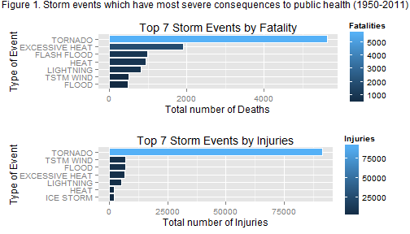
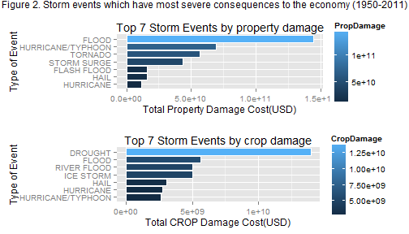

 
## Most Harmful Storms and Weather Events In The United States


### Synopsis

This report seeks to investigate storms and other weather events that cause the highest number of fatalities and injuries. Moreover, it shows which events have the greatest economic consequences. Understanding the impacts of different weather events on public health and the economy of the nation is essential to take necessary preparations and to mobilize resources in the right time. The data used for the analysis is drawn from the U.S. National Oceanic and Atmospheric Administration's [(NOAA)][1] storm database. The data for the analysis covers the period from 1950 to November 2011.
<br/>
The Analysis shows that Tornadoes are the most harmful weather events with respect to public health. Moreover, the analysis reveals that while floods result in the most harmful property damages, droughts cause the the most severe crop failures.


###Data Processing
   
First and foremost, let's clear the workspace and load required libraries.
      

```r
    rm(list=ls())    # clear workspace
    
   library(plyr)
   
   library(ggplot2)
   library(gridExtra)
```
   
<br/>
      
      
Then, let's load the dataset and understand its contents. The data used for the analysis is drawn from the U.S. National Oceanic and Atmospheric Administration's [(NOAA)][1] storm database. The data for the analysis covers the period from 1950 to November 2011. The data can be downloaded from this [link][2].
   

```r
storm <- tempfile()

download.file("http://d396qusza40orc.cloudfront.net/repdata%2Fdata%2FStormData.csv.bz2", storm)

data <-read.csv(storm)

unlink(storm)

 names(data)   # To see the different variables of the dataset
```

```
##  [1] "STATE__"    "BGN_DATE"   "BGN_TIME"   "TIME_ZONE"  "COUNTY"    
##  [6] "COUNTYNAME" "STATE"      "EVTYPE"     "BGN_RANGE"  "BGN_AZI"   
## [11] "BGN_LOCATI" "END_DATE"   "END_TIME"   "COUNTY_END" "COUNTYENDN"
## [16] "END_RANGE"  "END_AZI"    "END_LOCATI" "LENGTH"     "WIDTH"     
## [21] "F"          "MAG"        "FATALITIES" "INJURIES"   "PROPDMG"   
## [26] "PROPDMGEXP" "CROPDMG"    "CROPDMGEXP" "WFO"        "STATEOFFIC"
## [31] "ZONENAMES"  "LATITUDE"   "LONGITUDE"  "LATITUDE_E" "LONGITUDE_"
## [36] "REMARKS"    "REFNUM"
```
     
<br/>
      
So, from the list of variables, for our analysis we need event type, fatalities, property and crop damage, and property and crop damage exponent. Let's extract the variables of interest for further analysis.
   

```r
   data2<-data[,c("EVTYPE", "FATALITIES", "INJURIES",
            "PROPDMG","PROPDMGEXP","CROPDMG","CROPDMGEXP")]

   summary(data2)
```

```
##                EVTYPE         FATALITIES          INJURIES        
##  HAIL             :288661   Min.   :  0.0000   Min.   :   0.0000  
##  TSTM WIND        :219940   1st Qu.:  0.0000   1st Qu.:   0.0000  
##  THUNDERSTORM WIND: 82563   Median :  0.0000   Median :   0.0000  
##  TORNADO          : 60652   Mean   :  0.0168   Mean   :   0.1557  
##  FLASH FLOOD      : 54277   3rd Qu.:  0.0000   3rd Qu.:   0.0000  
##  FLOOD            : 25326   Max.   :583.0000   Max.   :1700.0000  
##  (Other)          :170878                                         
##     PROPDMG          PROPDMGEXP        CROPDMG          CROPDMGEXP    
##  Min.   :   0.00          :465934   Min.   :  0.000          :618413  
##  1st Qu.:   0.00   K      :424665   1st Qu.:  0.000   K      :281832  
##  Median :   0.00   M      : 11330   Median :  0.000   M      :  1994  
##  Mean   :  12.06   0      :   216   Mean   :  1.527   k      :    21  
##  3rd Qu.:   0.50   B      :    40   3rd Qu.:  0.000   0      :    19  
##  Max.   :5000.00   5      :    28   Max.   :990.000   B      :     9  
##                    (Other):    84                     (Other):     9
```

```r
   str(data2)
```

```
## 'data.frame':	902297 obs. of  7 variables:
##  $ EVTYPE    : Factor w/ 985 levels "   HIGH SURF ADVISORY",..: 834 834 834 834 834 834 834 834 834 834 ...
##  $ FATALITIES: num  0 0 0 0 0 0 0 0 1 0 ...
##  $ INJURIES  : num  15 0 2 2 2 6 1 0 14 0 ...
##  $ PROPDMG   : num  25 2.5 25 2.5 2.5 2.5 2.5 2.5 25 25 ...
##  $ PROPDMGEXP: Factor w/ 19 levels "","-","?","+",..: 17 17 17 17 17 17 17 17 17 17 ...
##  $ CROPDMG   : num  0 0 0 0 0 0 0 0 0 0 ...
##  $ CROPDMGEXP: Factor w/ 9 levels "","?","0","2",..: 1 1 1 1 1 1 1 1 1 1 ...
```
      
<br/>
      
We see that there is no missing value, so no need of imputting missing values.      
Next, let's calculate deaths and injuries by event type to determine which storms and other weather events are most harmful to public health in the nation.
   

```r
   fatalities<-aggregate(FATALITIES~EVTYPE,data2,sum)
   injuries<-aggregate(INJURIES~EVTYPE,data2,sum)
```
     
     
<br/>
      
Let's look at the top 7 storms with the highest number of injuries and fatalities.
   

```r
   top_7_fatality<-arrange(fatalities, desc(fatalities$FATALITIES))[1:7,]
   top_7_injury<-arrange(injuries, desc(injuries$INJURIES))[1:7,]
```
   
<br/>
   
Next, let's similarly extract the seven storms and weather events that cause the most severe propery and crop damage. First, however, let's see the exponents of property damage(PROPDMGEXP) and crop damage(CROPDMGEXP) in the dataset so as to convert the given property and crop damage values to thier exact values by multiplying them by the exponent variable.
 
 

```r
unique(data2$PROPDMGEXP)
```

```
##  [1] K M   B m + 0 5 6 ? 4 2 3 h 7 H - 1 8
## Levels:  - ? + 0 1 2 3 4 5 6 7 8 B h H K m M
```

```r
unique(data2$CROPDMGEXP)
```

```
## [1]   M K m B ? 0 k 2
## Levels:  ? 0 2 B k K m M
```

<br/>
   
We can assume the letters show exponents and take the numbers as they are. Therefore, we will convert the letters to thier respective exponents. We can take k and 3 as 10^3, M, m and 6 as 10^6, h, H, and 2 as 10^2,'B' as 10^9, 0, ?, and + as 10^0, 1 as 10^1, 5 as 10^5, 7 as 10^7, and 8 as 10^8. Hence, let's multiply the propery and crop damage values by thier respective exponents. As a side note, it is important to mention here that since the datset covers a long time period (from 1950-2011), there are some inconsistencies in the exponents of crop and property damage such as m, M and h, H. For the purpose of this analysis, upper and lower letter exponents will be considered the same.
 
 

```r
for (i in 1:length(data2$CROPDMGEXP)){
       
       if (data2$PROPDMGEXP[i]=='k' | data2$PROPDMGEXP[i]=="K")
       {data2$PROPDMG[i]=data2$PROPDMG[i]*10^3}
       
       if (data2$PROPDMGEXP[i]=='B')
       {data2$PROPDMG[i]=data2$PROPDMG[i]*10^9}
       
       if (data2$PROPDMGEXP[i]=='m' |data2$PROPDMGEXP[i]=='M')
       {data2$PROPDMG[i]=data2$PROPDMG[i]*10^6}
       
       if (data2$PROPDMGEXP[i]=='h' | data2$PROPDMGEXP[i]=='H')
       {data2$PROPDMG[i]=data2$PROPDMG[i]*10^2}
       
       if (is.numeric(data2$PROPDMGEXP[i]))
       {data2$PROPDMG[i]=data2$PROPDMG[i]*10^data2$PROPDMGEXP[i]}
       
       
       if (data2$CROPDMGEXP[i]=='k' | data2$CROPDMGEXP[i]=="K")
       {data2$CROPDMG[i]=data2$CROPDMG[i]*10^3}
       
       if (data2$CROPDMGEXP[i]=='B')
       {data2$CROPDMG[i]=data2$CROPDMG[i]*10^9}
       
       if (data2$CROPDMGEXP[i]=='m' |data2$CROPDMGEXP[i]=='M')
       {data2$CROPDMG[i]=data2$CROPDMG[i]*10^6}
       
       if (data2$CROPDMGEXP[i]=='h' | data2$CROPDMGEXP[i]=='H')
       {data2$CROPDMG[i]=data2$CROPDMG[i]*10^2}
       
       if (is.numeric(data2$CROPDMGEXP[i]))
       {data2$CROPDMG[i]=data2$CROPDMG[i]*10^data2$CROPDMGEXP[i]}

       
   }
```


<br/>
    
 Now, let's calculate property damage and crop damage by event type.


```r
   prop_damage<-aggregate(PROPDMG~EVTYPE,data2,sum)
   crop_damage<-aggregate(CROPDMG~EVTYPE,data2,sum)
```
     
  
<br/>
  
  
Next, let's see the top seven most severe stroms with the highest property and crop damage values.
   

```r
   top_7_property<-arrange(prop_damage, desc(prop_damage$PROPDMG))[1:7,]
   top_7_crop<-arrange(crop_damage, desc(crop_damage$CROPDMG))[1:7,]
```
  
   
###Results
      
Now, let's see barplots of fatalities and enjuries, by event type, of the top seven stroms with the highest number of fatalities and injuries.


```r
#  Fatalities

colnames(top_7_fatality)<-c('EVTYPE', 'Fatalities')
colnames(top_7_injury)<-c('EVTYPE', 'Injuries')

f1<-  ggplot(top_7_fatality, aes(x=reorder(EVTYPE, Fatalities), 
                             y=Fatalities,fill=Fatalities))+ 
       geom_bar(stat='identity',colour='white')+
       ggtitle('Top 7 Storm Events by Fatality')+
       xlab('Type of Event')+
       coord_flip()+
       ylab('Total number of Deaths')


#  Injuries

 f2<-  ggplot(top_7_injury, aes(x=reorder(EVTYPE, Injuries), 
                            y=Injuries,fill=Injuries))+ 
       geom_bar(stat='identity',colour='white')+
       ggtitle('Top 7 Storm Events by Injuries')+
       xlab('Type of Event')+
       coord_flip()+
       ylab('Total number of Injuries')

grid.arrange(f1, f2, main="Figure 1. Storm events which have most severe consequences to public health (1950-2011)")
```

 

   
Similarly, let's see barplots of the seven most severe storms with the highest propery and crop damage values.

<br />
      

```r
#  Propery Damage

names(top_7_property)<-c('EVTYPE', 'PropDamage')
 f1<- ggplot(top_7_property, aes(x=reorder(EVTYPE, PropDamage), 
                             y=PropDamage,fill=PropDamage))+ 
       geom_bar(stat='identity',colour='white')+
       ggtitle('Top 7 Storm Events by property damage')+
       xlab('Type of Event')+
      coord_flip()+
       ylab('Total Property Damage Cost(USD)')


#  Crop Damage

names(top_7_crop)<-c('EVTYPE', 'CropDamage')
 f2<-  ggplot(top_7_crop, aes(x=reorder(EVTYPE, CropDamage), 
                            y=CropDamage,fill=CropDamage))+ 
       geom_bar(stat='identity',colour='white')+
       ggtitle('Top 7 Storm Events by crop damage')+
       xlab('Type of Event')+
        coord_flip()+
       ylab('Total CROP Damage Cost(USD)')

grid.arrange(f1, f2, main="Figure 2. Storm events which have most severe consequences to the economy (1950-2011)")
```

 


<br/>
   
   
We see from the barplots that Tornadoes cause the highest problem to public health. While floods are associated with highest property damage, droughts result in the most severe crop failures. 
 
### Summary
 
This short analysis is a project done for the Reproducible Research [course][3] offered by The Johns Hopkins Bloomberg School of Public Health, Department of [Biostatistics][4], on [Coursera][5]. The Analysis shows that Tornadoes are the most harmful weather events with respect to public health. Moreover, the analysis reveals that while floods result in the most harmful property damages, droughts cause the the most severe crop failures.
<br/>

[1]: http://www.noaa.gov/ "(NOAA)"
[2]: https://d396qusza40orc.cloudfront.net/repdata%2Fdata%2FStormData.csv.bz2 "link"
[3]: https://class.coursera.org/repdata-014   "course"
[4]: http://www.jhsph.edu/departments/biostatistics/  "Biostatistics" 
[5]: https://www.coursera.org/  "Coursera"


