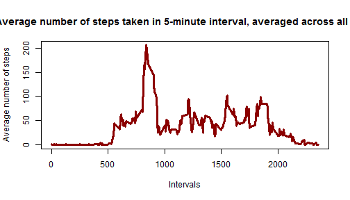
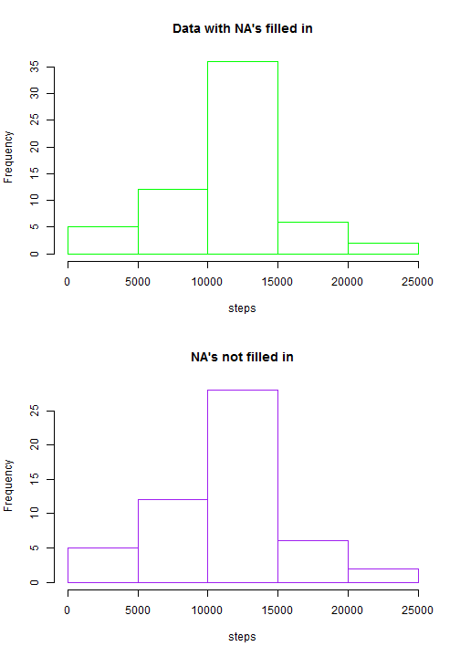
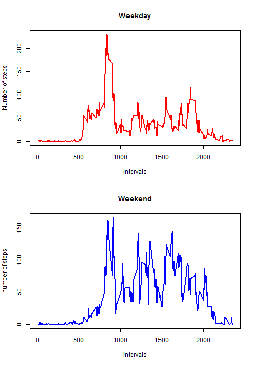

#### Loading and preprocessing the data
   <br />

*Show any code that is needed to*

1. Load the data (i.e. read.csv())


First, let's clear the workspace and download a library that helps to add hour and minute

```r
rm(list=ls())    # clear workspace

library(dplyr)
```

    <br />
     
Then, let's download the data and understand its contents

```r
data<-read.csv("activity.csv", sep=',', header=TRUE)  # loading data

# Let us have a look at the data dimensions, variables 

names(data)
```

```
## [1] "steps"    "date"     "interval"
```

```r
dim(data)
```

```
## [1] 17568     3
```

```r
str(data)
```

```
## 'data.frame':	17568 obs. of  3 variables:
##  $ steps   : int  NA NA NA NA NA NA NA NA NA NA ...
##  $ date    : Factor w/ 61 levels "2012-10-01","2012-10-02",..: 1 1 1 1 1 1 1 1 1 1 ...
##  $ interval: int  0 5 10 15 20 25 30 35 40 45 ...
```

```r
head(data)
```

```
##   steps       date interval
## 1    NA 2012-10-01        0
## 2    NA 2012-10-01        5
## 3    NA 2012-10-01       10
## 4    NA 2012-10-01       15
## 5    NA 2012-10-01       20
## 6    NA 2012-10-01       25
```

```r
tail(data)
```

```
##       steps       date interval
## 17563    NA 2012-11-30     2330
## 17564    NA 2012-11-30     2335
## 17565    NA 2012-11-30     2340
## 17566    NA 2012-11-30     2345
## 17567    NA 2012-11-30     2350
## 17568    NA 2012-11-30     2355
```

  <br />

2. Process/transform the data (if necessary) into a format suitable for your analysis


```r
# Let's add hour and minute

data <- mutate(data, hour = interval %/% 100, minute = interval %% 100)  
```

  <br />

#### What is mean total number of steps taken per day?

*For this part of the assignment, missing values will be ignored!*

1. Calculate the total number of steps taken per day


```r
daily<-c()  # This will be the total number of steps taken per day


for (i in 1:61){ # total number of days in October and November is 31+30=61
    start<-(i-1)*288+1  # 288 five-minute steps in a day; 24*60/5=288
    last<-(i-1)*288+288
    temp<-data[start:last,1]    # extracting all 5-minute steps for each day
    daily<-c(daily,sum(temp))   # concatenating the daily totals  
}
```


  <br />

2. Make a histogram of the total number of steps taken each day


```r
daily_noNA<-daily[!is.na(daily)]  # 8 NA's are removed

hist(daily_noNA, xlab="steps",ylab="Frequency",
     main="Histogram of the total number of steps taken each day")
```

 

   <br />

3. Calculate and report the mean and median of the total number of steps taken per day

   The mean of  total number of steps taken per day is:

```r
mean(daily,na.rm=T)
```

```
## [1] 10766.19
```

 The median of  total number of steps taken per day is:
 

```r
median(daily,na.rm=T)
```

```
## [1] 10765
```

  <br />


#### What is the average daily activity pattern?


1. Make a time series plot (i.e. type = "l") of the 5-minute interval (x-axis) and the average number of steps taken, averaged across all days (y-axis)


```r
x<-data[,1]         # number of steps in 5-minute intevals
y<-matrix(x,288,61) # so as to get average of 5-minute intevals across all days  

five_average<-apply(y,1,mean,na.rm=TRUE)  # 5-minute interval average number of steps taken, 
# averaged across all days

plot(data$interval[1:288],five_average, type='l',col='darkred',
     xlab='Intervals',lwd=3,
     ylab='Average number of steps',
     main ='Average number of steps taken in 5-minute interval, averaged across all days')
```

 

    
        <br />
        
      

2. Which 5-minute interval, on average across all the days in the dataset, contains the maximum number of steps?


```r
hr<-data$hour[1:288]
min<-data$minute[1:288]

hr_max<-hr[which(five_average==max(five_average))]
min_max<-min[which(five_average==max(five_average))]

cat('The maximum number of steps occurs at',hr_max,':',min_max,'AM')
```

```
## The maximum number of steps occurs at 8 : 35 AM
```

    <br />

#### Imputing missing values

1. Calculate and report the total number of missing values in the dataset (i.e. the total number of rows with NAs)

The total number of missing values is:


```r
sum(is.na(data[,1]))
```

```
## [1] 2304
```

   <br />

2. Devise a strategy for filling in all of the missing values in the dataset. The strategy does not need to be sophisticated. For example, you could use the mean/median for that day, or the mean for that 5-minute interval, etc.


I will fill in missing values using the mean of the 5-minute interval

```r
# five_average is the 5-minute average across all days as shown in plotting the histogram above

# Then we can fill in all mising values with the average for that 5-minute interval across all days

# Let us replicate the 5-minute interval average over the number of days

five_average_rep<- rep(five_average,61)

data1<-data   # creating a copy of the datset so as to not mess up the original data

for (i in 1:length(data1[,1])){  # there are 61 days
    
    if(is.na(data1[i,1])==TRUE){
        data1[i,1]= five_average_rep[i]  # missing values replaced
    }}
```


   <br />
   
3. Create a new dataset that is equal to the original dataset but with the missing data filled in.

data1 in question 2 above is the same as the original dataset, with all missing values filled in by the mean for that 5-minute interval across all days.

  <br />

4. Make a histogram of the total number of steps taken each day and Calculate and report the mean and median total number of steps taken per day. Do these values differ from the estimates from the first part of the assignment? What is the impact of imputing missing data on the estimates of the total daily number of steps?


```r
# Calculate the total number of steps taken per day using the data with filled NA's

daily1<-c()


for (i in 1:61){              #  the total number of days in October and November is 31+30=61
    start<-(i-1)*288+1        #  there are 288 five-minute steps in a day; 24*60/5=288
    last<-(i-1)*288+288
    temp<-data1[start:last,1]    # extracting all 5-minute steps for each day
    daily1<-c(daily1,sum(temp))   # concatenating the daily totals 
}
```

   <br/>
Histograms of the total number of steps taken each day using both the original data and missing data replaced with 5-minute average across all days


```r
par(mfrow=c(2,1))

hist(daily1, xlab="steps",ylab="Frequency",
     main="Data with NA's filled in",border='green')

hist(daily_noNA, xlab="steps",ylab="Frequency",
     main="NA's not filled in",border='purple')
```

 

```r
# The mean of  total number of steps taken per day is:

mean(daily1)
```

```
## [1] 10766.19
```

```r
# The median of  total number of steps taken per day is:

median(daily1)
```

```
## [1] 10766.19
```

  <br />
  
  
*Do these values differ from the estimates from the first part of the assignment?*
*What is the impact of imputing missing data on the estimates*
*of the total daily number of steps?*

Yes, they show diferreneces in the median and in the histograms.
imputing missing data on the estimates of the total daily number of steps 
changes the median, and the distribution as as can be seen from the histograms.Based on the method used for filling in missing values, we can get different mean and median values. The histogram can also be different based on the strategy we used to fill in the missing values


  <br />


####Are there differences in activity patterns between weekdays and weekends?

1. Create a new factor variable in the dataset with two levels - "weekday" and "weekend" indicating whether a given date is a weekday or weekend day.


```r
data1$date<-as.Date(data1$date)

data1$day<-weekdays(data1$date)

data1_weekdays<-data1[(!data1$day %in% c("Saturday","Sunday")),]  # weekdays

data1_weekend<-data1[(data1$day %in% c("Saturday","Sunday")),]   #  weekend

weekday_steps<-data1_weekdays[,1]

temp<-matrix(weekday_steps,nrow=288)

weekday_steps_average<-apply(temp,1,mean)


weekend_steps<-data1_weekend[,1]

temp<-matrix(weekend_steps,nrow=288)

weekend_steps_average<-apply(temp,1,mean)
```


   <br />
   
2. Make a panel plot containing a time series plot (i.e. type = "l") of the 5-minute interval (x-axis) and the average number of steps taken, averaged across all weekday days or weekend days (y-axis)


```r
par(mfrow=c(2,1))

plot(data$interval[1:288],weekday_steps_average, type="l",xlab='Intervals',ylab="Number of steps",
     col='red',lwd=2, main="Weekday")

plot(data$interval[1:288],weekend_steps_average, type="l", xlab='Intervals',ylab="number of steps",
     col='blue',lwd=2,main="Weekend")
```

 


